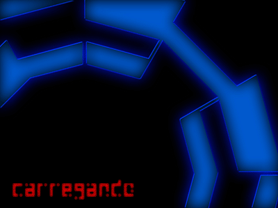

# Tradução das Texturas
Aqui contém todas as texturas que foram traduzidas para o português, além de conter a comparação das texturas, trancrições e anotações sobre a qualidade e escolhas na adaptação.

## cached.wad (✅ Revisado)
| Textura | Original | Tradução | Detalhes |
| ------- | -------- | -------- | -------- |
| LOADING400 | LOADING | CARREGANDO | ✅ Tradução literal |
| |  |  | ℹ️ Editável ✅ Perfeita  |
| LOADING640 | LOADING | CARREGANDO | ✅ Tradução literal |
| |  |  | ℹ️ Editável ✅ Perfeita   |
